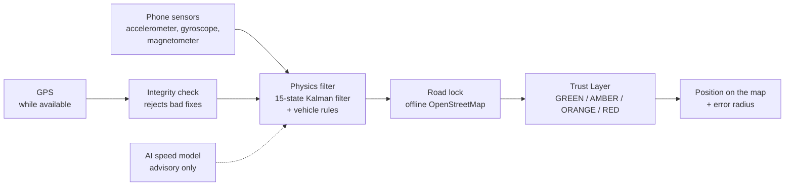

<p align="center">
  <picture>
    <source media="(prefers-color-scheme: dark)" srcset="frontend/assets/icons/wordmark_dark.png">
    
  </picture>
</p>

<p align="center"><strong>Keeps a vehicle on the right road when GPS drops, using only the phone already in the car.</strong></p>

<p align="center">
  
  
  
  
</p>

| | |
|---|---|
| **Challenge** | SIH26168 (ISRO): *AI-ML based Intelligent Dead Reckoning system for seamless navigation* |
| **Team** | CodeAstra (ID 120431). Team leader: Vinit Girdhar |
| **Try it** | Website, demo film and Android APK: **https://gatisaarth.vercel.app/** |
| **What it is** | An Android app (Flutter). No extra hardware, no accounts, no cloud |

---

## The problem

Every tunnel, underpass, flyover and basement is a guaranteed GPS blackout. When GPS drops, a navigation app **freezes** the marker, lets it **jump**, or keeps it moving in a **straight line** at the last speed. The driver misses an exit, the ETA is wrong, and delivery fleets, ride-hailing and emergency vehicles lose track.

The fixes that exist need hardware. Dead-reckoning chips (for example u-blox) need wheel-speed wiring and a fixed install in each vehicle. Tunnel beacons (Waze Beacons) need equipment inside each tunnel. Neither helps a driver whose only navigator is a phone.

## Our solution

When GPS drops, GatiSaarth keeps estimating position from the phone's own motion sensors, keeps that estimate on real roads using an offline map, and tells the driver how far to trust it.



1. **Sense.** Accelerometer, gyroscope and magnetometer at about 50 Hz, plus GPS position, velocity and Doppler speed while GPS is available.
2. **Learn the mount.** The app works out how the phone sits in the vehicle from normal driving. No manual calibration. A rigid mount works best.
3. **Physics core.** A 15-state error-state Kalman filter (the family used in aircraft inertial navigation) integrates the motion sensors. Vehicle rules keep it honest: a car does not slide sideways, and a stopped car has zero speed.
4. **Road lock.** During an outage the estimate is held to real roads read from the offline map on the phone, so turns and junctions stay correct. A live GPS fix is never snapped.
5. **Trust Layer.** The engine takes over the displayed position only while it predicts live GPS at least as well as simply holding the last velocity. Otherwise the app keeps its normal pipeline. A colour-coded status and an error radius show the driver how far to trust the position.
6. **Safe recovery.** A chi-squared test screens GPS for jumps and multipath, and the first fix after an outage is validated before the marker moves to it. The marker glides back instead of jumping.

**About the AI.** A 209 KB TensorFlow Lite speed model is **advisory**. It is trusted only while its output agrees with live GPS Doppler speed, and the physics filter always has the final say. The engine runs correctly with the model switched off.

---

## Proof

### Public benchmark: 32 real drives, lab-grade ground truth

We replayed **32 drives (28.9 hours)** from the public **IO-VNBD** dataset (Coventry and West Midlands, UK) through our engine. Ground truth is a Racelogic VBOX reference receiver. Each drive was scored by withholding GPS for 10 to 120 s at many start times.

**Drift** = position error as a percentage of the distance driven during the blackout (median over drives). **Straight-line** = keep the last velocity, which is what apps do today.

| Blackout | GatiSaarth | Straight-line | Error reduction | Drives scored |
|---:|---:|---:|---:|---:|
| 10 s | **4.6 %** | 18.0 % | 3.9x | 26 |
| 30 s | **8.6 %** | 36.3 % | 4.2x | 25 |
| 60 s | **12.5 %** | 57.8 % | 4.6x | 25 |
| 120 s | **18.4 %** | 68.8 % | 3.7x | 23 |

- **SIH target (drift under 10 %): met up to 30 s.** Not met at 60 s or 120 s.
- Closer to the truth than straight-line in **1,061 of 1,282** individual blackout windows (83 %).
- In metres: at 40 km/h a 60 s blackout is about 667 m of driving. GatiSaarth ends about **83 m** off, straight-line about **385 m** (arithmetic from the percentages above).
- **What is real and what is a stand-in.** Drives, roads and ground truth are real. The motion sensors are the *car's own built-in sensors* (10 Hz), used as a stand-in for an external IMU. This is not a phone-sensor result. 6 of the 32 drives have no score (the engine did not lead, or no window could be scored).

Raw results: [`docs/evidence/iovnbd_outage_benchmark.json`](docs/evidence/iovnbd_outage_benchmark.json). Method and caveats: [`docs/evidence/iovnbd_engine_and_map_evidence.md`](docs/evidence/iovnbd_engine_and_map_evidence.md).

### Anyone can re-check our numbers

- **Outage Benchmark** (in the app: Profile > Outage Benchmark) replays any recorded drive with GPS withheld and scores the engine and the straight-line baseline against the withheld fixes. It needs no reference receiver, so it works on any phone.
- Replays are **bit-exact**: the same log always gives the same result.
- The report exports as JSON, CSV or PDF, stamped with a SHA-256 hash and an Android Keystore signature.

### Other measurements

| What | Result | Note |
|---|---|---|
| Filter cost | about 20 µs per sensor update (74 µs worst case) | Under 0.5 % of one CPU core at 50 Hz. Measured in a debug build. |
| Biggest accuracy lever | The vehicle rule "no sideways slide" cut 60 s drift from 15.4 % to 1.4 % | **Simulated** drives with modelled sensor error. Explains the design; not field accuracy. |
| Automated tests | 1,336 pass, 28 skipped, 5 fail | The 5 failures are out-of-date UI-wording checks after the redesign (for example a hard-coded "v4.5.1"), not engine logic. `flutter test` in `frontend/` |
| Edge port (C++17) | 1,523x real time on a laptop CPU | Synthetic drive. A separate port for external IMUs; the app does not use it. |

---

## The Trust Layer

The app never pretends. It always shows how far to trust the position.

| Level | Meaning | What the driver sees |
|---|---|---|
| **GREEN** | Reliable. Live GPS. | Normal navigation |
| **AMBER** | Dead reckoning, locked to the road | Dashed red track, growing error radius |
| **ORANGE** | High uncertainty | Warning, wide error radius |
| **RED** | Unreliable | *Limited Navigation Mode*: no exact coordinates, guidance paused, "Follow road signs" |

---

## What the app does

| Feature | What it does |
|---|---|
| **Dead reckoning through outages** | Keeps a live position in tunnels, underpasses, flyovers and basements. Solid blue track with GPS, dashed red track without. |
| **Offline maps** | OpenStreetMap vector maps (PMTiles). Delhi NCR and Mumbai are bundled. Maharashtra, Pune, Nagpur, Nashik and Chhatrapati Sambhajinagar download once, inside the app, and can be deleted. |
| **Offline journey planning** | Place search on the installed maps, route preview, next-turn banner, distance and ETA, reroute. During a GPS outage the position follows the saved route. |
| **Tunnel look-ahead** | "Tunnel ahead, 1.2 km", then metres to the exit, so the engine is prepared before GPS is lost. |
| **Parking level** | Car-park floor (B1, B2, L1) from the barometer after GPS is lost. |
| **Simulation Lab** | Tunnel test, urban-canyon test, and a timed GPS-loss test that withholds real GPS for 10 to 60 s on a live drive and gives a scorecard: error in metres, drift %, PASS or FAIL against the 10 % target. |
| **Health checks** | Sensor hardware check, mount-quality score and GPS health (normal, multipath suspected, interference suspected, outage). |
| **Fault Injection Lab** | Injects a GPS jump, sensor bias, dropout or timestamp delay into a replayed drive and shows what the app detected. |
| **Drive recorder and signed reports** | Records real drives for scoring and exports signed benchmark reports. |
| **Vehicle profile** | Car or two-wheeler. |

Also: outage haptic alert, share last trusted position with its radius, light and dark themes.

---

## See it in 3 minutes

| Step | Do | You see |
|---|---|---|
| 1 | Open the **Map** tab | Vector map, live position, accuracy ring drawn to scale in metres |
| 2 | **Simulation Lab** > **Tunnel test** | GPS is cut. Status turns AMBER, the track turns dashed red, the error radius grows honestly. The marker keeps turning and stops when the vehicle stops. |
| 3 | Tap **End test** | The marker glides back to the GPS fix. No teleport. |
| 4 | **Simulation Lab** > **Urban canyon test** | Bad GPS fixes are rejected: "GNSS integrity anomaly detected". |
| 5 | **Simulation Lab** > **Timed GPS loss test** (10 to 60 s) | A scorecard when the timer ends: distance, error in metres, drift %, PASS or FAIL |
| 6 | Turn on Airplane Mode and zoom around | The map stays sharp. Everything is on the phone. |
| 7 | Profile > **Outage Benchmark** | Scored run on a recorded or reference drive, with a signed report |

The emulator has no moving sensors, so dead reckoning there stops after a few seconds. Judge accuracy on a real phone in a vehicle, or with the benchmark.

---

## How we compare

| | Nav apps (Google Maps, etc.) | u-blox dead-reckoning chips | Tunnel beacons (Waze) | **GatiSaarth** |
|---|---|---|---|---|
| Extra hardware per vehicle | None | Wheel-speed wiring, fixed install | Hardware in every tunnel | **None** |
| During a GPS blackout | Freeze, jump or straight line | Continuous | Only inside equipped tunnels | **Continuous, road-locked** |
| Shows how far to trust it | Accuracy circle, not tied to outage drift | n/a | n/a | **Trust Layer and error radius** |
| Per-drive evidence | Closed | Vendor spec sheets | n/a | **Bit-exact replay, signed report** |
| Very long outages (2 min+) | n/a | **Holds accuracy longer (wheel ticks)** | n/a | Drift keeps growing, flagged ORANGE or RED |

---

## Honest limits

We prefer to state these ourselves.

1. **Public benchmark uses the car's sensors, not a phone's.** It tests the algorithm against reference-grade truth. Phone-sensor accuracy is a separate question.
2. **Real phone drives are not yet proof.** We recorded 4 real drives (about 11 km, Mumbai, two realme phones). On three the mount never aligned, so the engine declined to lead. On the one where it led, it was worse than straight-line at 10 to 60 s and slightly better at 120 s. In these cases the Trust Layer keeps the app on its normal pipeline, so the driver is no worse off. A controlled campaign with a rigid mount is the next step. Simulated drives are labelled as simulated and never quoted as field accuracy.
3. **Long outages.** Above about 60 s the median drift is over 10 %, and at 120 s it is 18 % on the public set. The Trust Layer turns ORANGE or RED as error grows.
4. **The mount must be learned first.** Alignment needs about 40 s of accelerating and braking on a straight road. Until then the app runs its normal pipeline.
5. **Road lock needs a map.** It works wherever an installed map pack covers the vehicle, and is off elsewhere. Lane level is not claimed.
6. **AI model is advisory.** On held-out drives it does not pass the GPS agreement check, so navigation there is identical with or without it.
7. **Not yet verified on a phone:** offline journey planning and map performance were checked on the Android 16 emulator only. Other Android versions and phones are untested.
8. **Off by default:** turn speedometer, tyre-vibration speedometer, per-vehicle AI calibration, lean-aware two-wheeler constraint and bend registration are built and tested but stay off until a real drive shows they help.

---

## Run it

**Install:** download the APK from https://gatisaarth.vercel.app/ (Android 7.0 or newer).

**Build from source** (Flutter 3.47.4, Android SDK 36, JDK 17):

```bash
git clone https://github.com/vinitgirdhar/GATISAARTHII.git
cd GATISAARTHII/frontend
flutter pub get
flutter run                     # emulator or phone
flutter build apk --release     # release APK
```

The bundled Delhi NCR (37 MB) and Mumbai (26 MB) map archives are git-ignored. Without them the app still runs; download a region in Profile > Offline Maps. To rebuild them see [`tools/offline_maps/README.md`](tools/offline_maps/README.md).

**Test:**

```bash
cd frontend
flutter analyze
flutter test
```

**Re-run the public benchmark** (needs the IO-VNBD dataset, which is not in the repo):

```bash
python ml/src/dataset/fetch_iovnbd.py
python ml/src/dataset/iovnbd_to_drive_log.py --imu vehicle --all --min-minutes 5 --out ml/data/processed/drive_logs_vehicle
cd frontend
IOVNBD_LOG_DIR=../ml/data/processed/drive_logs_vehicle EVIDENCE_DIR=../docs/evidence flutter test test/nav/iovnbd_outage_benchmark_test.dart
```

**Score your own drive:** Profile > Vehicle, then Sensors > Record drive, drive, stop. Score it in the app (Profile > Outage Benchmark) or on a PC:

```bash
cd frontend
DRIVE_LOG=path/to/drive.jsonl.gz flutter test test/nav/score_drive_test.dart
```

**Emulator GPS:** `adb emu geo fix <lon> <lat>`. Send fixes several times a second; at 1 Hz the emulator repeats fixes and the integrity check rightly rejects the jump.

---

## Repository map

```
frontend/      Flutter Android app
  lib/core/nav/          Navigation engine (pure Dart): filter, GPS integrity, road matching,
                         alignment, replay, outage benchmark, journey routing
  lib/core/platform/     Sensors, GPS, offline maps (PMTiles), storage
  lib/features/          Screens and state
  assets/                Bundled maps, speed model, icons
  test/                  Automated tests
cpp-core/      C++17 edge port for external IMUs (not used by the app)
ml/            IO-VNBD data pipeline and speed-model training
docs/          Evidence (docs/evidence), architecture notes, field-test protocol, paper draft
landing_page/  Project website with an interactive simulator (illustration, not the engine)
tools/         Offline map cutting, APK sync
```

---

## Privacy

- No accounts, no ads, no tracking, no backend. Navigation needs no network.
- After the one-time map download, everything runs on the phone.
- Drive recordings stay in the app's private storage and leave only if the user shares them. App backup is disabled so location traces are not copied to the cloud.

## Credits and licences

- Map data: © [OpenStreetMap](https://www.openstreetmap.org/copyright) contributors (ODbL). Vector tiles cut from [Protomaps](https://protomaps.com) builds.
- Benchmark data: IO-VNBD, Onyekpe et al., *Data in Brief*, vol. 35, 2021.
- Built with [Flutter](https://flutter.dev), [flutter_map](https://pub.dev/packages/flutter_map), [pmtiles](https://pub.dev/packages/pmtiles), [geolocator](https://pub.dev/packages/geolocator), [sensors_plus](https://pub.dev/packages/sensors_plus) and [tflite_flutter](https://pub.dev/packages/tflite_flutter).
- Optional online raster fallback (only in builds made with a `STADIA_API_KEY`): © Stadia Maps, © OpenMapTiles, © OpenStreetMap contributors.
