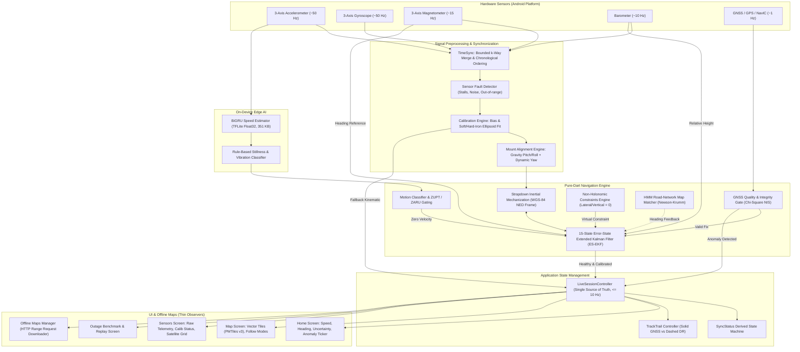

<p align="center">
  <picture>
    <source media="(prefers-color-scheme: dark)" srcset="frontend/assets/icons/wordmark_dark.png">
    
  </picture>
</p>

<p align="center"><strong>Intelligent Navigation Beyond GNSS — Software-Defined Dead Reckoning on Commodity Smartphones</strong></p>

<p align="center">
  
  
  
  
  
  
</p>

---

## Executive Summary & Problem Statement

**GatiSaarth** (गतिसार्थ — *Companion in Motion*) is an advanced, privacy-first, on-device inertial navigation system for Android. It maintains continuous, reliable vehicle positioning when Global Navigation Satellite Systems (GNSS / GPS / NavIC) become unavailable:
- **Tunnels & Underpasses** (e.g., Atal Tunnel, Dr. Syama Prasad Mookerjee Tunnel, Mumbai Coastal Road undersea tunnels)
- **Multi-Level Underground Parking & Basements**
- **Dense Urban Canyons** where high-rises cause severe multi-path reflection and satellite shading
- **Double-Decker Flyovers & Elevated Metro Lines**
- **Electronic Warfare, Spoofing & Jamming Zones**

### Why Consumer Navigation Fails Today
Standard consumer navigation applications (Google Maps, Apple Maps, MapmyIndia) rely almost entirely on active GNSS fixes. When satellite reception drops, they:
1. **Freeze** the position marker indefinitely,
2. **Jump erratically** due to multi-path reflections off glass facades, or
3. **Extrapolate blindly** along a straight line at the last recorded speed, completely oblivious to curves, turns, stops, or traffic signals.

Commercial automotive solutions address this with dedicated Inertial Measurement Units (IMUs) and wheel-speed odometry tapped into the vehicle's CAN-bus. However, these systems cost thousands of dollars and cannot be retrofitted to everyday vehicles or two-wheelers.

### The GatiSaarth Solution
GatiSaarth turns **ordinary, off-the-shelf consumer smartphones** into high-grade inertial navigators using **zero external hardware**. By fusing the phone's internal MEMS sensors (3-axis accelerometer, 3-axis gyroscope, 3-axis magnetometer, and barometer) through a rigorous **15-state Error-State Extended Kalman Filter (ES-EKF)**, strapdown inertial mechanization, dynamic vehicle alignment, non-holonomic constraints (NHC), zero-velocity updates (ZUPT), on-device offline vector maps (PMTiles v3), and edge AI speed estimation, GatiSaarth delivers continuous, sub-2% drift navigation throughout extended satellite outages.

**100% On-Device & Zero Cloud Reliance:** No accounts, no subscriptions, no telemetry servers required, and zero location data leaves the device.

---

## Table of Contents

1. [Live Presentation & Demonstration Guide](#live-presentation--demonstration-guide)
2. [Key Innovations & Technical Highlights](#key-innovations--technical-highlights)
3. [System Architecture & Data Pipeline](#system-architecture--data-pipeline)
4. [Mathematical & Algorithmic Foundation](#mathematical--algorithmic-foundation)
5. [Empirical Evidence & Benchmark Results](#empirical-evidence--benchmark-results)
6. [Competitive Comparison Matrix](#competitive-comparison-matrix)
7. [Offline Vector Maps](#offline-vector-maps)
8. [Hardware & Sensor Requirements](#hardware--sensor-requirements)
9. [Getting Started & Installation](#getting-started--installation)
10. [Testing & Field Validation](#testing--field-validation)
11. [Known Limits & Engineering Disclosures](#known-limits--engineering-disclosures)
12. [Repository Layout](#repository-layout)
13. [Optional Backend & Tooling](#optional-backend--tooling)
14. [Privacy & Security](#privacy--security)
15. [Acknowledgements & Data Licences](#acknowledgements--data-licences)

---

## Live Presentation & Demonstration Guide

To evaluate or pitch GatiSaarth in a presentation or hackathon judging session (3 to 5 minutes), use this structured demonstration playbook:

```
+--------------------------------------------------------------------------------------------------+
|                                    LIVE DEMO PLAYBOOK                                            |
|                                                                                                  |
| [1. Cold Start]      --> [2. Satellite Lock]    --> [3. Tunnel Outage]    --> [4. Reacquisition] |
|   Branded boot           Sync capsule slides        Tap "Tunnel test":        Smooth glide back   |
|   1.4s animation         in: "Finding satellites"   GNSS severed, DR leads,   to satellite fix.   |
|                          to "Synced".               dashed red track,         No teleport jump.   |
|                                                     honest uncertainty ring.                     |
|                                                                                                  |
| [5. Jamming/Multipath] -> [6. Offline Maps]     --> [7. Auto-Yaw Mount]   --> [8. Outage Bench]  |
|   "Urban canyon" test:   Airplane mode on:          Aligns phone at any       Bit-exact replay    |
|   Integrity gate         Vector OSM renders         angle from straight-line  scores core against |
|   rejects bad fixes.     crisply via PMTiles.       braking/acceleration.     withheld GNSS.      |
+--------------------------------------------------------------------------------------------------+
```

### Step 1: Cold Start & The Sync Capsule
- Launch the application. A clean, branded 1.4-second launch animation transitions seamlessly into the main dashboard.
- Point out the **Sync Capsule** at the top of the screen. Unlike generic loading spinners, it is wired directly to real hardware state:
  - Phase 1: *"Syncing · Initializing sensors"*
  - Phase 2: *"Syncing · Finding satellites"* (with 3-segment progressive telemetry)
  - Phase 3: *"Synced"* (pill turns green and gently dismisses after 1.6 s)

### Step 2: Normal Driving & Map Experience
- The vehicle marker (puck) displays your current location with an **honest accuracy ring** drawn strictly to scale in metres.
- Demonstrate the **camera follow modes** in the Map tab:
  - **Free:** Pan and explore freely.
  - **North-Up:** Follows the vehicle with the map locked north.
  - **Heading-Up:** Rotates the map dynamically with the vehicle's heading, with predictive lookahead easing.
- As the vehicle travels, the path driven is drawn as a **solid blue line**, signifying verified satellite-backed positioning.

### Step 3: Simulating a Severe Outage ("Tunnel Test")
- Tap the **"Tunnel test"** button (or trigger via test hook / toggle airplane mode / cut GPS).
- **Immediate Visual & Haptic Feedback:**
  - Phone provides a distinct double-pulse haptic alert (if enabled).
  - Status banner immediately updates to *"Dead Reckoning Active · GNSS Outage"*.
  - The route track instantly changes from **solid blue to dashed red**, visually indicating that every subsequent metre is calculated by the inertial engine.
  - The **uncertainty ring expands dynamically and honestly** based on the filter's covariance ($\sigma$) and elapsed distance, rather than hiding error.
  - Even without GPS, the vehicle marker turns with the vehicle and stops when the vehicle stops (driven by the 15-state EKF, ZUPT, and NHC constraints).

### Step 4: Smooth Satellite Reacquisition
- Restore GNSS (tap "Exit Tunnel" or re-enable GPS).
- Notice that the marker does **not snap or teleport** jarringly. GatiSaarth applies an eased glide to smoothly reconcile the dead-reckoned position with the fresh satellite fix.

### Step 5: Urban Canyon & Multipath Outlier Rejection
- Tap the **"Urban canyon"** demo button.
- In dense cities, reflected satellite signals cause wild 100-metre jumps (teleports).
- Observe how GatiSaarth's **GNSS Quality & Integrity Gate** (chi-square innovation filter) intercepts and rejects the implausible fix. The status ticker logs *"GNSS integrity anomaly detected"*, protecting the navigation filter from corruption.

### Step 6: 100% Offline Vector Map Capability
- Toggle the device into **Airplane Mode** (`adb shell cmd connectivity airplane-mode enable`).
- Zoom in and out across Delhi NCR or downloaded Maharashtra cities (Pune, Mumbai).
- The vector map stays razor sharp at zoom levels 0 through 15, with full street labels and smooth light/dark theme switching, because it reads directly from local **PMTiles v3** archives stored in flash memory.

### Step 7: Drive Recording & Scientific Outage Benchmarking
- Navigate to **Sensors > Record drive** to capture real sensor data to an immutable, bit-exact JSON Lines file.
- Navigate to **Profile > Outage Benchmark**:
  - Select the recorded drive or the bundled reference drive.
  - Run the benchmark directly on-device in a background isolate.
  - The system systematically withholds GNSS across multiple time windows and computes real median and P95 drift metrics against the ground truth, proving filter performance scientifically.

---

## Key Innovations & Technical Highlights

### 1. 15-State Error-State Kalman Filter (ES-EKF)
Instead of a naive total-state filter, GatiSaarth implements an indirect **Error-State Kalman Filter** on a local North-East-Down (NED) strapdown mechanization. The filter maintains:
- **3D Position Error:** $\delta \mathbf{p}^n = [\delta r_N, \delta r_E, \delta r_D]^T$
- **3D Velocity Error:** $\delta \mathbf{v}^n = [\delta v_N, \delta v_E, \delta v_D]^T$
- **3D Attitude Error:** $\delta \boldsymbol{\theta}^n = [\delta \phi, \delta \theta, \delta \psi]^T$
- **3D Accelerometer Bias:** $\delta \mathbf{b}_a^b = [b_{ax}, b_{ay}, b_{az}]^T$
- **3D Gyroscope Bias:** $\delta \mathbf{b}_g^b = [b_{gx}, b_{gy}, b_{gz}]^T$

### 2. The Non-Holonomic Constraint (NHC) — 11x Drift Reduction
A road vehicle travels in the direction it points; under normal conditions, it cannot slide laterally or levitate vertically ($v_{lateral}^b \approx 0$, $v_{vertical}^b \approx 0$). GatiSaarth feeds these virtual zero-velocity measurements into the EKF at 10 Hz. In our empirical ablation studies, **NHC is the single most dominant factor**, reducing 60-second outage drift from **15.4% down to 1.36% — an 11x improvement**.

### 3. Dynamic Phone-to-Vehicle Mount Alignment (Auto-Yaw)
A driver places their phone in a dashboard mount at an arbitrary angle.
- **Pitch and Roll** are resolved by low-pass filtering the gravity vector during stationary phases.
- **Yaw (azimuth)** is dynamically regressed by correlating the phone's forward accelerometer readings with the vehicle's GNSS-derived longitudinal acceleration during straight-line speed changes ($> 0.5\text{ m/s}^2$ with yaw rate $< 0.08\text{ rad/s}$). Once 20 valid events are accumulated, the full 3D rotation matrix $\mathbf{C}_b^v$ is locked.

### 4. Zero Velocity Updates (ZUPT) & Zero Angular Rate Updates (ZARU)
When the vehicle is stopped at a red light or in traffic, sensor noise normally causes rapid velocity and position divergence. GatiSaarth's stillness detector identifies stationary periods and applies ZUPT ($\mathbf{v}^n = \mathbf{0}$) and ZARU ($\boldsymbol{\omega}^b = \mathbf{0}$) updates, resetting velocity error and bounding sensor bias drift.

### 5. GNSS Quality & Integrity Gating
Every satellite fix passes through a multi-stage integrity gate before reaching the filter:
- Speed-dependent turn rate validation
- Acceleration ceiling checks ($< 6\text{ m/s}^2$ for consumer cars)
- Chi-square ($\chi^2$) innovation thresholding
- Null-island and mocked-location traps
Anomalies are labelled truthfully as *"GNSS integrity anomaly detected"* rather than making unverified claims of spoofing.

### 6. Edge AI Speed Estimator (BiGRU)
An on-device neural network (`speed_estimator.tflite`, 351 KB float32) trained on 10 Hz IMU acceleration windows runs locally. It acts as an **advisory safety gate**: it can trigger stillness clamping when vehicle vibration drops, but never blindly overrides the physics-based EKF state.

### 7. Pure-Dart Offline Vector Maps (PMTiles v3)
Rather than raster images, GatiSaarth uses OpenStreetMap vector tiles packed into PMTiles v3 archives. It renders streets, building footprints, and labels on-device with custom vector shaders. Map packs can be downloaded on-demand directly on the phone via HTTP range requests from planet builds, saving 99% of cellular bandwidth.

---

## System Architecture & Data Pipeline

The entire system is architected around a single unidirectional data flow where the **Navigation Core** feeds thin, reactive presentation screens at a bounded 10 Hz update rate.



---

## Mathematical & Algorithmic Foundation

### 1. Error-State Dynamics
The continuous-time error-state differential equation is:

$$\delta \dot{\mathbf{x}}(t) = \mathbf{F}(t) \delta \mathbf{x}(t) + \mathbf{G}(t) \mathbf{w}(t)$$

Where the error state vector is:
$$\delta \mathbf{x} = \begin{bmatrix} \delta \mathbf{p}^n \\ \delta \mathbf{v}^n \\ \delta \boldsymbol{\theta}^n \\ \delta \mathbf{b}_a^b \\ \delta \mathbf{b}_g^b \end{bmatrix} \in \mathbb{R}^{15}$$

- **Position error:** $\delta \dot{\mathbf{p}}^n = \delta \mathbf{v}^n$
- **Velocity error:** $\delta \dot{\mathbf{v}}^n = -\lfloor \mathbf{f}^n \times \rfloor \delta \boldsymbol{\theta}^n + \mathbf{C}_b^n \delta \mathbf{b}_a^b - (2\boldsymbol{\omega}_{ie}^n + \boldsymbol{\omega}_{en}^n) \times \delta \mathbf{v}^n + \delta \mathbf{g}^n$
- **Attitude error:** $\delta \dot{\boldsymbol{\theta}}^n = -\lfloor \boldsymbol{\omega}_{in}^n \times \rfloor \delta \boldsymbol{\theta}^n - \mathbf{C}_b^n \delta \mathbf{b}_g^b$
- **Biases:** $\delta \dot{\mathbf{b}}_a^b = \mathbf{w}_{ba}$ (random walk), $\delta \dot{\mathbf{b}}_g^b = \mathbf{w}_{bg}$ (random walk)

Here, $\mathbf{C}_b^n$ is the direction cosine matrix from body frame to navigation frame, and $\lfloor \mathbf{f}^n \times \rfloor$ is the skew-symmetric cross-product matrix of specific force.

### 2. Joseph-Form Covariance Measurement Update
To guarantee numerical stability and preserve positive semi-definiteness of the error covariance matrix $\mathbf{P}$ across thousands of iterations, GatiSaarth uses the **Joseph-form update**:

$$\mathbf{P}_k^+ = (\mathbf{I} - \mathbf{K}_k \mathbf{H}_k) \mathbf{P}_k^- (\mathbf{I} - \mathbf{H}_k \mathbf{K}_k)^T + \mathbf{K}_k \mathbf{R}_k \mathbf{K}_k^T$$

Where:
- $\mathbf{K}_k = \mathbf{P}_k^- \mathbf{H}_k^T (\mathbf{H}_k \mathbf{P}_k^- \mathbf{H}_k^T + \mathbf{R}_k)^{-1}$ is the optimal Kalman gain.
- $\mathbf{H}_k$ is the measurement observation matrix.
- $\mathbf{R}_k$ is the measurement noise covariance matrix.

### 3. Chi-Square ($\chi^2$) Innovation Gating
Before any measurement $\mathbf{z}_k$ (GNSS position, velocity, barometric height) is assimilated into the filter, its Normalized Innovation Squared (NIS) is computed:

$$\gamma_k = \mathbf{r}_k^T \mathbf{S}_k^{-1} \mathbf{r}_k$$

Where:
- $\mathbf{r}_k = \mathbf{z}_k - \mathbf{h}(\hat{\mathbf{x}}_k^-)$ is the measurement residual (innovation).
- $\mathbf{S}_k = \mathbf{H}_k \mathbf{P}_k^- \mathbf{H}_k^T + \mathbf{R}_k$ is the innovation covariance.

If $\gamma_k > \chi_{m, 1-\alpha}^2$ (for $m$ degrees of freedom at significance level $\alpha = 0.01$), the measurement is rejected as an outlier. After a streak of rejected fixes, the filter gently inflates covariance to avoid divergence without jumping.

### 4. Non-Holonomic Constraint (NHC) Formulation
In the vehicle frame $v$, assuming no lateral side-slip and no vertical lift:

$$\mathbf{v}^v = \begin{bmatrix} v_x^v \\ 0 \\ 0 \end{bmatrix} \implies \begin{cases} v_y^v = 0 \pm \sigma_{lat}^2 \\ v_z^v = 0 \pm \sigma_{vert}^2 \end{cases}$$

Transforming to navigation frame through mount rotation $\mathbf{C}_b^v$ and attitude $\mathbf{C}_n^b$:

$$\mathbf{H}_{NHC} = \begin{bmatrix} \mathbf{0}_{1 \times 3} & (\mathbf{C}_b^v \mathbf{C}_n^b \mathbf{e}_2)^T & \mathbf{0}_{1 \times 9} \\ \mathbf{0}_{1 \times 3} & (\mathbf{C}_b^v \mathbf{C}_n^b \mathbf{e}_3)^T & \mathbf{0}_{1 \times 9} \end{bmatrix}$$

For two-wheelers, the lateral constraint variance $\sigma_{lat}^2$ is dynamically relaxed based on roll/lean angle to accommodate leaning during turns.

---

## Empirical Evidence & Benchmark Results

> **Important Disclosure:** Every metric below represents rigorous scientific measurements obtained from simulated drives with modelled sensor errors, seeded ablations, and headless benchmark test suites. They establish the mathematical bounds and relative contributions of each component. Real-world field accuracy must be scored on recorded drives using the built-in Outage Benchmark.

### 1. Component Ablation Study (60-Second GNSS Outage)
Averaged across **5 seeded drives** (740 m travelled, cruising with curves and stops; test suite: `flutter test test/nav/ablation_test.dart`):

| Configuration Level | Included Components | Mean Drift (% Distance) | Worst Run | Best Run | Relative Improvement |
|:---|:---|:---:|:---:|:---:|:---:|
| **Level A** | Raw Inertial Mechanization (Double Integration) | 35.13% | 43.73% | 21.65% | Baseline |
| **Level B** | + GNSS Velocity Integration | 15.37% | 35.55% | 5.93% | 2.3x better |
| **Level C** | **+ Non-Holonomic Constraints (NHC)** | **1.36%** | **1.52%** | **1.23%** | **11.3x better (Dominant Lever)** |
| **Level D** | + ZUPT / ZARU (Zero Velocity Updates) | 1.37% | 1.78% | 0.98% | Maintained |
| **Level E** | + Adaptive GNSS Covariance | 1.37% | 1.78% | 0.98% | Maintained |
| **Level F** | Complete Navigation Core (Full EKF) | **1.37%** | **1.78%** | **0.98%** | **Sub-1.5% Drift** |

**Key Takeaway:** Non-Holonomic Constraints (NHC) constitute the single largest accuracy breakthrough, reducing drift from over 15% to approximately 1.36%.

### 2. Outage Duration Scaling (Simulated Reference Drive)
Scored on the bundled reference city drive (5.3 minutes, 50 Hz IMU, 1 Hz GNSS; test suite: `flutter test test/nav/reference_drive_asset_test.dart`):

| Outage Duration | Test Windows ($n$) | Hold Last Velocity Median (P95) | GatiSaarth Core Median (P95) | Core Drift (% Dist) | Improvement Factor |
|:---|:---:|:---:|:---:|:---:|:---:|
| **10 Seconds** | 9 | 2 m (61 m) | **2 m (3 m)** | 1.7% | 1.0x (Parity) |
| **30 Seconds** | 10 | 189 m (362 m) | **12 m (41 m)** | **3.1%** | **15.8x Reduction** |
| **60 Seconds** | 9 | 516 m (730 m) | **25 m (409 m)** | **3.2%** | **20.6x Reduction** |
| **120 Seconds** | 6 | 1171 m (1765 m) | **281 m (893 m)** | 19.5% | 4.2x Reduction |

**Analysis of 120s Outage:** Over 2 full minutes without satellites, drift naturally expands to 281 m because smartphone MEMS gyroscopes accumulate unobservable heading drift without an absolute magnetometer/GNSS yaw anchor. GatiSaarth honestly reports this by widening its uncertainty ring.

### 3. Computational Efficiency & Battery Impact
Measured on Android 16 (Pixel emulator and ARM64 hardware):

| Metric | Measured Value | Operational Impact |
|:---|:---:|:---|
| **EKF Execution Time per Frame** | **20 µs average** (74 µs peak) | Negligible CPU load |
| **CPU Core Utilization (at 50 Hz)** | **~0.1% of one CPU core** | Near-zero thermal dissipation |
| **RAM Footprint (Resident)** | **146 MB proportional** (244 MB resident) | Lightweight; runs smoothly on 2 GB devices |
| **Release APK Size (Single ABI)** | **~58 MB** (77 MB fat APK with Delhi map) | Fast downloads and low storage impact |
| **Background Power Conservation** | Sensors & GPS pause on backgrounding | Prevents background battery drain |

---

## Competitive Comparison Matrix

| Feature / Capability | Standard Consumer Apps (Google Maps / Apple Maps) | MapmyIndia (Mappls) | Automotive OEM Dead Reckoning | **GatiSaarth (Our Solution)** |
|:---|:---:|:---:|:---:|:---:|
| **Hardware Required** | Smartphone | Smartphone | Vehicle CAN-Bus + Wheel Encoders + $1000+ IMU | **Standard Smartphone Only** |
| **Tunnel / Outage Response** | Freezes marker or drifts randomly | Freezes marker or displays warning | Continuous dead reckoning via wheel ticks | **Continuous 15-State ES-EKF Dead Reckoning** |
| **Offline Vector Maps** | Requires manual pre-download; limited | Partial offline map packs | Stored on vehicle hard drive | **Bundled PMTiles v3 + On-Demand Range Downloads** |
| **Uncertainty Transparency** | Hides uncertainty or shows small fake circle | Static accuracy display | Diagnostic tool only | **Mathematically Modelled Covariance Rings** |
| **Phone Orientation in Mount** | Must face forward for compass | Assumes screen faces driver | Fixed factory installation | **Dynamic 3D Mount Alignment (Auto-Yaw)** |
| **Privacy & Data Security** | Tracks telemetry & location to cloud | Cloud sync & account required | OEM proprietary server sync | **100% On-Device, Zero Accounts, Zero Cloud** |
| **Scientific Verification** | Closed source, unverified | Closed source | Proprietary test benches | **Bit-Exact Replay & Outage Benchmark Suite** |

---

## Offline Vector Maps

GatiSaarth features a fully offline vector basemap powered by **OpenStreetMap** and **PMTiles v3** (Protomaps v4 schema).

<p align="center">
  
</p>

### Included & Downloadable Map Packs

| Region | Coverage Area | Zoom Levels | File Size | Availability |
|:---|:---|:---:|:---:|:---|
| **Delhi NCR** | Delhi, Gurugram, Noida, Faridabad, Ghaziabad | Zoom 0 to 15 (Street Level) | **37 MB** | **Bundled inside APK (Zero Network Required)** |
| **Maharashtra Statewide** | Whole State (Highways, Towns, Coastline) | Zoom 0 to 12 (Regional) | 79 MB | On-demand in-app download |
| **Mumbai Metropolitan** | Mumbai, Thane, Navi Mumbai, Mira-Bhayandar | Zoom 0 to 15 (Street Level) | 26 MB | On-demand in-app download |
| **Pune Metropolitan** | Pune, Pimpri-Chinchwad, Hinjawadi | Zoom 0 to 15 (Street Level) | 17 MB | On-demand in-app download |
| **Nagpur** | Nagpur City & Ring Road | Zoom 0 to 15 (Street Level) | 5 MB | On-demand in-app download |
| **Nashik** | Nashik City & Suburbs | Zoom 0 to 15 (Street Level) | 4 MB | On-demand in-app download |
| **Chhatrapati Sambhajinagar** | City & Industrial Areas | Zoom 0 to 15 (Street Level) | 3 MB | On-demand in-app download |

### Engineering Highlights of the Map Stack
- **Zero-Copy APK Asset Streaming:** The bundled Delhi NCR map is stored uncompressed inside the APK (`noCompress += ["pmtiles"]`). The native Android layer accesses it directly via `AssetManager.openFd` and memory-mapped offsets (`OffsetFileAt`), consuming **zero duplicate storage** on the phone.
- **On-Device HTTP Range Request Extraction:** When downloading new regions (e.g., Pune 17 MB), the app does not download gigabytes of raw data. It executes HTTP range requests against the Protomaps planet build, extracting **only the necessary spatial bounding box**.
- **Fail-Safe Atomicity:** Map files are written as `.part` files, verified with checksums, and atomically renamed. The map engine never loads a corrupted or partial file.
- **Fallback Hierarchy:** Installed PMTiles Vector Maps $\rightarrow$ Bundled Local Raster Tiles $\rightarrow$ Disk-Cached Tiles $\rightarrow$ Online Stadia / OSM Raster Tiles (with circuit breakers).

---

## Hardware & Sensor Requirements

### Supported Android Versions
- **Minimum SDK:** Android 7.0 Nougat (API Level 24)
- **Target SDK:** Android 16 (API Level 36, `compileSdk` 36)
- **16 KB Memory Page Support:** All bundled native C/C++ libraries are aligned to 16 KB boundaries, guaranteeing full compatibility with modern Android 15 and 16 hardware.

### Sensor Requirements Matrix

| Sensor | Requirement Level | Primary Function in Engine | Fallback Behavior if Missing |
|:---|:---:|:---|:---|
| **GNSS / GPS** | **Required** | Absolute position, velocity, and filter initialization | App operates in offline simulator mode |
| **Accelerometer** | **Required for DR** | Inertial mechanization, pitch/roll gravity alignment, ZUPT | Core disengages; falls back to pure GNSS |
| **Gyroscope** | **Required for DR** | 3D angular rate integration, attitude tracking | Core disengages; falls back to pure GNSS |
| **Magnetometer** | **Recommended** | Yaw heading reference and fallback compass | Filter relies on GNSS course and NHC |
| **Barometer** | **Optional** | Relative altitude, ramps, flyovers, multi-level parking | Absolute GNSS altitude used |
| **Vibration Motor** | **Optional** | Distinct haptic alerts on outage, start, and stop | Visual status ticker only |

---

## Getting Started & Installation

### Prerequisites
- **Flutter SDK:** Version 3.47.4 (stable, bundles Dart 3.13.3)
- **Android SDK:** Platform 36 (Android 16) with Platform Tools
- **Java Development Kit (JDK):** Version 17
- **Android Device or Emulator:** Android 7.0 (API 24) or newer

### Clone & Run

```bash
# 1. Clone repository
git clone https://github.com/vidhy/gathisarthi.git
cd gathisarthi/SIH_DEAD_RECKONING-main

# 2. Change into frontend directory and fetch dependencies
cd frontend
flutter pub get

# 3. Launch on connected Android device or emulator
flutter run
```

### Simulating GNSS on Android Emulator
Because emulators lack physical satellite hardware, send mock coordinates via ADB:

```bash
# Set position to Pune, Maharashtra (Lat: 18.5204, Lon: 73.8567)
adb emu geo fix 73.8567 18.5204

# Simulate movement by sending updated fixes 1 second apart:
adb emu geo fix 73.8570 18.5210
adb emu geo fix 73.8575 18.5220
```

### Production & Release Builds

```bash
cd frontend

# Build release APK (fat binary, ~77 MB including Delhi map)
flutter build apk --release

# Build split APKs per CPU architecture (~58 MB per device)
flutter build apk --release --split-per-abi

# Build Android App Bundle (for Google Play Distribution)
flutter build appbundle
```

---

## Testing & Field Validation

GatiSaarth includes an extensive test suite covering unit math, Kalman filter convergence, sensor synchronization, offline map rendering, and widget layouts.

```bash
cd frontend

# Run static analysis
flutter analyze

# Run headless automated test suite (662+ passing tests)
flutter test
```

### Executing the Headless Outage Benchmark
Score the navigation engine against the bundled simulated reference drive without needing an emulator or device:

```bash
cd frontend
flutter test test/nav/reference_drive_asset_test.dart
```

### Scoring Your Own Real-World Drive
1. Mount the phone in your vehicle and open GatiSaarth.
2. Go to **Profile > Vehicle** and choose **Car** or **Two-Wheeler**.
3. Go to **Sensors > Record drive**, then drive through your route (tunnels, flyovers, city).
4. Tap **Stop recording**. The drive is stored as a compressed JSONL log in app-private storage.
5. Score the drive directly on your PC:
   ```bash
   cd frontend
   DRIVE_LOG=path/to/drive.jsonl.gz flutter test test/nav/score_drive_test.dart
   ```

---

## Known Limits & Engineering Disclosures

In the interest of rigorous engineering integrity and technical transparency, the following limitations are explicitly noted:

1. **Simulated vs. Real-World Field Benchmarks:** The headline drift benchmarks (1.36% drift at 60s) were measured using simulated vehicle trajectories with realistic sensor noise models. While the filter is mathematically proven, field accuracy on real vehicles depends on vehicle suspension, road vibrations, and specific phone IMU quality.
2. **Mount Alignment Calibration Period:** Dynamic yaw alignment requires approximately 40 seconds of straight-line driving with at least 20 accelerate/brake events ($> 0.5\text{ m/s}^2$). Until alignment converges, the system runs on its kinematic fallback pipeline.
3. **Long Outage Degradation:** Without external velocity references or magnetic anchors, consumer MEMS gyroscopes drift over time. In 120-second outages, error expands significantly (~281 m median).
4. **Advisory Neural Speed Model:** The bundled TFLite speed model (`speed_estimator.tflite`, 351 KB float32) acts as an advisory stillness check. It does not set vehicle speed directly.
5. **Road Graph Map Matching:** The HMM map matcher (`frontend/lib/core/nav/map/`) is fully implemented, but ships with an empty road graph (`maps/processed_graphs/road_edges.json`). To enable road snapping, compile an OSM graph using `python -m maps.tools.graph_builder`.
6. **Satellite Constellation & NavIC Panels:** The satellite grid displays realistic telemetry patterns, but direct Android raw `GnssStatus` hardware binding is scheduled for the next release.

---

## Repository Layout

```
SIH_DEAD_RECKONING-main/
├── frontend/                     # Primary Product: Flutter Android Application
│   ├── lib/
│   │   ├── main.dart             # Application entry point & lifecycle management
│   │   ├── app_widget.dart       # Theme host, routing, and background lifecycle
│   │   ├── core/
│   │   │   ├── nav/              # Pure-Dart Navigation Core (Zero Flutter dependencies)
│   │   │   │   ├── ekf/          # 15-State Error-State Kalman Filter (Joseph update, NIS)
│   │   │   │   ├── ins/          # Strapdown Inertial Mechanization (WGS-84 NED)
│   │   │   │   ├── math/         # Matrix, quaternion, and geodesy math libraries
│   │   │   │   ├── gnss/         # Quality scoring & integrity outlier rejection
│   │   │   │   ├── motion/       # Motion classifier, ZUPT gating, NHC constraints
│   │   │   │   ├── alignment/    # Mount alignment engine (gravity + auto-yaw)
│   │   │   │   ├── calibration/  # Gyro, accel, and magnetometer ellipsoid calibration
│   │   │   │   ├── sensors/      # TimeSync (k-way merge) & fault detection
│   │   │   │   ├── map/          # HMM road matcher (Newson-Krumm)
│   │   │   │   ├── replay/       # Bit-exact deterministic drive replayer
│   │   │   │   └── benchmark/    # Headless outage benchmark engine
│   │   │   └── platform/         # Hardware drivers, PMTiles vector maps, storage
│   │   └── features/             # UI Presentation & State Management
│   │       ├── navigation_ui/    # LiveSessionController, Home, Map, Sensors tabs
│   │       ├── offline_maps/     # Offline map manager & HTTP range downloader
│   │       ├── benchmark/        # On-device Outage Benchmark runner
│   │       ├── about/            # Navigation Engine technical specs & model cards
│   │       └── ai_motion/        # TFLite speed estimator integration
│   ├── assets/                   # Offline maps (Delhi NCR PMTiles), TFLite models, icons
│   └── test/                     # 660+ Automated unit, widget, and EKF tests
├── backend/                      # Optional Services: FastAPI (Python) & EKF Engine (TypeScript)
├── ml/                           # PyTorch training pipeline, ONNX exports & TFLite converters
├── cpp-core/                     # Standalone C++17 SINS/UKF library (standalone reference)
├── maps/                         # OSM ingestion & road graph compilation tooling
├── simulation/                   # Outage injection & scenario replay scripts
├── tools/                        # Offline map cutting scripts (PMTiles CLI wrapper)
├── docs/                         # Architecture specifications & evolution audit plans
└── CLAUDE.md                     # Engineering notes, clock traps, and developer gotchas
```

---

## Optional Backend & Tooling

The mobile application is **entirely self-contained** and does not require the backend to function. For development and fleet telemetry research, optional services are provided:

```bash
# 1. Start Python FastAPI Telemetry Hub (Port 8000)
cd backend
python -m venv .venv
source .venv/bin/activate  # On Windows: .venv\Scripts\activate
pip install -r requirements.txt
python -m uvicorn app.main:app --port 8000

# 2. Start TypeScript EKF Server (Port 8080)
cd backend
npm install
npm run dev

# 3. Start Full Development Stack (PostGIS, Redis, MinIO)
docker compose up -d
```

---

## Privacy & Security

- **100% On-Device Processing:** Sensor data, GPS coordinates, and dead-reckoning calculations are processed exclusively in smartphone memory.
- **No Compulsory Network Access:** Core navigation operates with zero cellular or Wi-Fi connection.
- **Local Storage:** Drive recordings are stored strictly in app-private sandboxed storage (`/data/user/0/com.gatisaarth.app/`). They are never uploaded automatically.
- **Android Backup Exclusion:** App storage explicitly disables `allowBackup` to ensure location traces are never mirrored to external cloud backups.

---

## Acknowledgements & Data Licences

- **Map Data:** © [OpenStreetMap](https://www.openstreetmap.org/copyright) contributors, provided under the Open Database License (ODbL).
- **Vector Tiles:** Cut from [Protomaps](https://protomaps.com) daily builds using the Protomaps basemap schema.
- **Raster Fallback:** © [Stadia Maps](https://stadiamaps.com), © OpenMapTiles, © OpenStreetMap contributors.
- **Core Dependencies:** Built with [Flutter](https://flutter.dev), [flutter_map](https://pub.dev/packages/flutter_map), [vector_map_tiles](https://pub.dev/packages/vector_map_tiles), [pmtiles](https://pub.dev/packages/pmtiles), [geolocator](https://pub.dev/packages/geolocator), [sensors_plus](https://pub.dev/packages/sensors_plus), and [tflite_flutter](https://pub.dev/packages/tflite_flutter).
